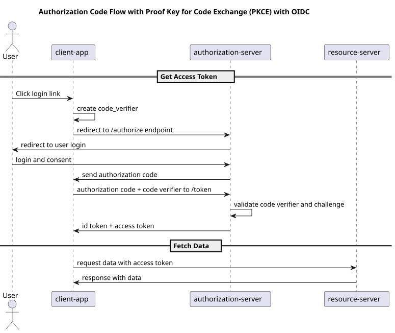
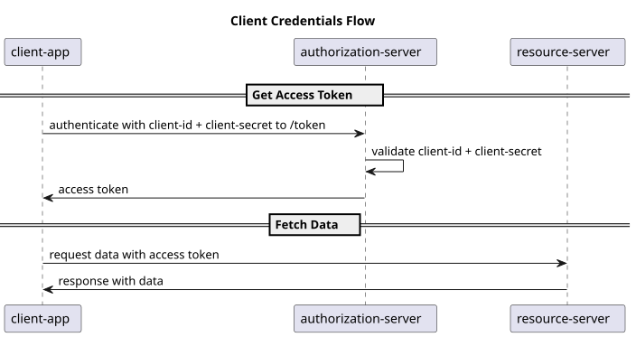

[](https://github.com/Lyse-AS/oauth2-playground/actions/workflows/build.yml)
# OAuth2 with OIDC playground
This project runs 3 servers:
- Authorization Server ([Documentation](authorization-server/README.md))
- Resource Server
- Client Application

The code originates from https://github.com/spring-projects/spring-authorization-server/tree/main/samples with some slight modifications.

# Authorization Code Flow


# Client Credential Flow



# Development
Running the Resource Server and the Client Application requires a running Authorization Server.

Run the Script `start-apps.sh` to start all 3 servers.

## Build without Azure Container Registry
```shell
docker run -d -p 5000:5000 --restart=always --name registry registry:2
mvn clean install -Dacr.publish=false -Dartifacts.server=localhost:5000
```
This will tag the images with `localhost:5000` as docker registry.

## Spring Boot and Rest
See: https://developer.okta.com/blog/2022/06/17/simple-crud-react-and-spring-boot


### Run the application on Azure
See https://github.com/Lyse-AS/deploy-my-application-to-k8s

