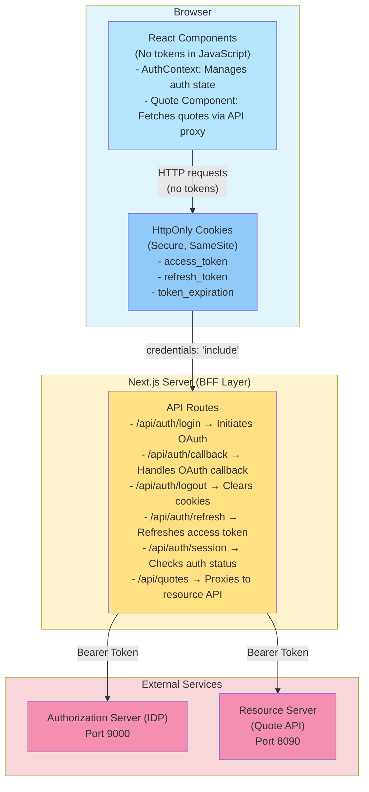

# Backend-for-Frontend (BFF) Pattern Implementation

## Overview

This Next.js application implements the **Backend-for-Frontend (BFF) pattern** for OAuth2 authentication with enhanced security. In this pattern, OAuth tokens are managed server-side in secure HttpOnly cookies, preventing exposure to client-side JavaScript and XSS attacks.

## Security Benefits

### Traditional SPA Approach (Insecure)
❌ **Access tokens stored in localStorage**
❌ **Vulnerable to XSS attacks** - any malicious script can steal tokens
❌ **Tokens visible in browser DevTools**
❌ **No HttpOnly protection**

### BFF Pattern (Secure)
✅ **Tokens stored in secure HttpOnly cookies**
✅ **Protected from XSS attacks** - JavaScript cannot access tokens
✅ **Tokens managed server-side only**
✅ **CSRF protection via SameSite cookies**
✅ **Automatic token refresh**
✅ **Secure flag enforced in production (HTTPS only)**

## Architecture



## Implementation Details

### 1. Cookie Management (`lib/cookies.ts`)

Utility functions for secure cookie operations:

- **setSecureCookie()** - Sets cookies with security flags
- **setAuthCookies()** - Stores OAuth tokens in cookies
- **clearAuthCookies()** - Removes all auth cookies
- **getAccessToken()** - Retrieves access token server-side
- **isTokenExpired()** - Checks token expiration

**Security Configuration:**
```typescript
{
  httpOnly: true,      // Prevents JavaScript access
  secure: true,        // HTTPS only (production)
  sameSite: 'lax',     // CSRF protection
  path: '/',
  maxAge: 3600         // Expiration in seconds
}
```

### 2. API Routes

#### `/api/auth/login` (GET)
- Generates PKCE code_verifier and code_challenge
- Stores PKCE parameters in secure cookies
- Redirects to authorization server

#### `/api/auth/callback` (GET)
- Receives OAuth callback with authorization code
- Validates state parameter (CSRF protection)
- Retrieves code_verifier from cookie
- Exchanges code for tokens
- Fetches user info
- Stores tokens in secure HttpOnly cookies
- Redirects to home page

#### `/api/auth/logout` (POST/GET)
- Clears all authentication cookies
- Returns success response or redirects

#### `/api/auth/refresh` (POST)
- Retrieves refresh token from cookie
- Exchanges for new access token
- Updates cookies with new tokens
- Handles token rotation

#### `/api/auth/session` (GET)
- Checks if user is authenticated
- Returns user info if available
- Used by AuthContext to maintain session state

#### `/api/quotes` (GET)
- Proxies requests to resource server
- Retrieves access token from cookie server-side
- Adds Bearer token to request
- Returns quote data to client
- **Client never sees the access token**

### 3. AuthContext Updates

The `AuthContext` has been significantly simplified:

**Before (localStorage):**
- Managed tokens in component state
- Stored tokens in localStorage
- Exposed tokens to JavaScript
- Manual token refresh logic

**After (BFF Pattern):**
- Only tracks authentication status
- Calls API routes for all operations
- No token exposure to client
- Automatic session management

Key methods:
- `login()` - Redirects to `/api/auth/login`
- `logout()` - Calls `/api/auth/logout`
- `refreshAccessToken()` - Calls `/api/auth/refresh`
- `checkSession()` - Calls `/api/auth/session`

### 4. Quote Component Updates

Updated to use API proxy instead of direct resource server calls:

**Before:**
```typescript
authenticatedFetch('http://localhost:8090/quote')
```

**After:**
```typescript
fetch('/api/quotes', { credentials: 'include' })
```

Includes automatic token refresh on expiration.

## Configuration Changes

### OAuth Config (`config/oauth.ts`)
```typescript
redirectUri: 'http://localhost:3000/api/auth/callback'  // Changed from /callback
```

The OAuth callback now points to the API route instead of a page route.

### Environment Variables
```bash
# Optional: Resource server URL
RESOURCE_SERVER_URL=http://localhost:8090

# Node environment (affects secure cookie flag)
NODE_ENV=production  # Uses secure flag
NODE_ENV=development # No secure flag (for HTTP)
```

## Usage

### Starting the Application

1. **Start dependencies:**
   ```bash
   # Start authorization server (port 9000)
   # Start resource server (port 8090)
   ```

2. **Start Next.js app:**
   ```bash
   npm run dev
   ```

3. **Access the application:**
   ```
   http://localhost:3000
   ```

### Authentication Flow

1. User clicks "Login" button
2. Browser redirects to `/api/auth/login`
3. API route generates PKCE parameters and redirects to IDP
4. User authenticates at IDP
5. IDP redirects to `/api/auth/callback?code=...&state=...`
6. API route validates, exchanges code for tokens
7. API route sets secure HttpOnly cookies
8. API route redirects to `/` (home page)
9. AuthContext detects authentication via `/api/auth/session`
10. User is logged in

### Making Authenticated Requests

Components use API proxy routes:

```typescript
// Frontend code (no tokens needed!)
const response = await fetch('/api/quotes', {
  credentials: 'include'  // Send cookies
});
```

The API route handles token management:

```typescript
// API route extracts token from cookie
const accessToken = await getAccessToken();

// API route calls resource server
const response = await fetch('http://localhost:8090/quote', {
  headers: { Authorization: `Bearer ${accessToken}` }
});
```

## Token Refresh Strategy

The application implements **reactive token refresh**:

1. Quote component attempts to fetch data
2. If API returns `needsRefresh: true`:
   - Call `/api/auth/refresh` to get new token
   - Retry the original request
3. If refresh fails:
   - Clear auth state
   - Prompt user to log in again

## Migration from localStorage Pattern

If migrating from the old localStorage-based approach:

1. ✅ Update `redirectUri` in `config/oauth.ts`
2. ✅ No code changes needed in most components
3. ✅ Old localStorage data is ignored
4. ✅ Users will need to log in again
5. ✅ Consider clearing localStorage on first load:
   ```typescript
   localStorage.removeItem('access_token');
   localStorage.removeItem('refresh_token');
   localStorage.removeItem('token_expiration');
   ```

## Security Considerations

### Cookie Security Flags

| Flag | Purpose | Production | Development |
|------|---------|------------|-------------|
| `httpOnly` | Prevent JS access | ✅ Always | ✅ Always |
| `secure` | HTTPS only | ✅ Required | ❌ Optional |
| `sameSite` | CSRF protection | ✅ 'lax' | ✅ 'lax' |

### PKCE (Proof Key for Code Exchange)

- ✅ Code verifier generated client-side
- ✅ Code challenge sent to authorization server
- ✅ Code verifier stored in secure HttpOnly cookie
- ✅ Verifier sent during token exchange
- ✅ Prevents authorization code interception attacks

### State Parameter Validation

- ✅ Random state generated during login
- ✅ State stored in secure cookie
- ✅ State validated during callback
- ✅ Prevents CSRF attacks

### Token Rotation

Consider implementing refresh token rotation:
- Issue new refresh token on each refresh
- Invalidate old refresh token
- Detect and prevent token reuse attacks

## Testing

### Test Authentication Flow
```bash
1. Open http://localhost:3000
2. Click "Login"
3. Enter credentials: user1/password
4. Verify redirect to home page
5. Check browser DevTools → Application → Cookies
   - Verify access_token cookie exists
   - Verify httpOnly flag is set
   - Verify secure flag (if HTTPS)
```

### Test Token Refresh
```bash
1. Log in
2. Wait for token to expire (or manually set short expiration)
3. Click "Get Quote"
4. Verify automatic token refresh
5. Verify quote is displayed
```

### Test Logout
```bash
1. Log in
2. Click "Logout"
3. Verify cookies are cleared
4. Verify user is logged out
```

## Troubleshooting

### Cookies Not Being Set
- Check `credentials: 'include'` in fetch requests
- Verify API routes use `await cookies()` from `next/headers`
- Check browser console for CORS errors

### Token Refresh Fails
- Verify refresh token is still valid
- Check authorization server logs
- Ensure `client_id` matches registered client

### HTTPS Required in Production
- Secure cookies require HTTPS
- Use reverse proxy (nginx) or hosting platform with SSL
- Consider using `secure: false` only in development

## Files Changed

### New Files
- `lib/cookies.ts` - Cookie management utilities
- `app/api/auth/login/route.ts` - Login initiation
- `app/api/auth/callback/route.ts` - OAuth callback handler
- `app/api/auth/logout/route.ts` - Logout handler
- `app/api/auth/refresh/route.ts` - Token refresh
- `app/api/auth/session/route.ts` - Session check
- `app/api/quotes/route.ts` - Resource server proxy

### Modified Files
- `context/AuthContext.tsx` - Simplified for BFF pattern
- `lib/quote-api.ts` - Use API proxy instead of direct calls
- `components/Quote.tsx` - Handle token refresh
- `config/oauth.ts` - Updated redirect URI
- `app/callback/page.tsx` - Simplified (legacy redirect)

## Additional Security Enhancements

Consider implementing:

1. **Content Security Policy (CSP)**
   ```javascript
   // next.config.js
   headers: [
     {
       key: 'Content-Security-Policy',
       value: "default-src 'self'; script-src 'self'"
     }
   ]
   ```

2. **Rate Limiting**
   - Limit API route calls per IP
   - Prevent brute force attacks

3. **Token Rotation**
   - Rotate refresh tokens on each use
   - Detect token reuse

4. **Session Monitoring**
   - Log authentication events
   - Detect suspicious activity

5. **Logout from All Devices**
   - Store session IDs
   - Implement global logout

## Resources

- [OAuth 2.0 BFF Pattern](https://datatracker.ietf.org/doc/html/draft-ietf-oauth-browser-based-apps)
- [OWASP Session Management](https://cheatsheetseries.owasp.org/cheatsheets/Session_Management_Cheat_Sheet.html)
- [Next.js API Routes](https://nextjs.org/docs/app/building-your-application/routing/route-handlers)
- [PKCE RFC 7636](https://datatracker.ietf.org/doc/html/rfc7636)
